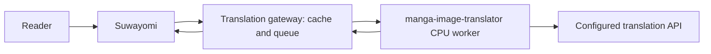

# Suwayomi Manga Translator

Automatic manga translation through Suwayomi's built-in HTTP image processor.
No Suwayomi fork, reader patch, or replacement source extension is required.

The service uses [manga-image-translator](https://github.com/zyddnys/manga-image-translator)
for detection, OCR, inpainting and typesetting, and a configurable LLM for
language decisions and translation into Simplified Chinese.

**Preview:** Linux ARM64 CPU deployment. First-time translation takes time;
previously processed pages are served from disk. Chinese and uncertain regions
are excluded before erasing. OCR and language identification are imperfect.

## What you get

- Automatic image processing while reading through Suwayomi.
- Region-level Chinese/uncertain-text skipping and original-image fallback.
- Content-addressed cache, duplicate-request coalescing, bounded queue and retries.
- A small management page: enable/pause, upload a test page, inspect jobs and compare images.
- Separate gateway and CPU worker containers, with CPU and memory limits.
- Streaming PNG responses for slow pages, keeping Suwayomi's 30-second idle read timeout alive.



The image postprocessor receives image bytes, not the manga title, chapter ID or
page number. This version has global enable/pause, not per-book rules or automatic
chapter pretranslation. Existing browser/reader caches may need refreshing.

## Install on Linux ARM64

Requires Docker Compose, approximately 5 GB available RAM for the configured worker
limit, disk space for the build, models and cache, and a working translation API.
The worker image is built on your ARM machine; no emulation is needed.
Other architectures and GPU deployments have not been validated in this preview.

```sh
git clone https://github.com/meurz/suwayomi-manga-translator.git
cd suwayomi-manga-translator
python3 scripts/init_config.py
# Edit worker.env: LLM_BASE_URL, LLM_API_KEY, LLM_MODEL, LLM_API.
# Use an OpenAI-compatible Responses API (responses) or Chat Completions API (chat).

# Set this to a Docker network your existing Suwayomi container is connected to.
export SUWAYOMI_NETWORK=your-suwayomi-network

docker compose build
docker compose run --rm worker python /app/scripts/warm_models.py
docker compose up -d
```

The upstream engine is pinned to commit `95227a2bb0fd306cd4f0c104d57284026f991b3a`.
The ARM worker dependency installation is pinned in `deploy/requirements-worker.lock`.
The optional Rust Paddle detector registration is disabled for this CPU build;
the upstream PyTorch detector, 48px OCR and LaMa MPE inpainter are used.

No API credentials belong in the repository or image. `worker.env` and
`gateway.env` are ignored by Git and Docker build contexts. Model changes also
require a new `CACHE_PROFILE` in `gateway.env`, preventing stale translations.

## Connect Suwayomi

Verified against Suwayomi Server **v2.3.2243**. The helper uses GraphQL settings;
Suwayomi applies the change at runtime without a source edit or restart.
Run it where the Suwayomi API is reachable. It currently expects a trusted local
API; if your API requires authentication, use its settings UI or adapt the
request headers to your authentication setup.

```sh
set -a
. ./gateway.env
set +a
python3 scripts/connect_suwayomi.py --server http://YOUR_SUWAYOMI_ADDRESS:4567
```

The helper backs up the previous `serveConversions`, then configures the
`default` image processor as `http://suwayomi-translator:8000/convert`, with the
processor token in a request header. It leaves `downloadConversions` untouched
so original server downloads remain available.

You can also set the equivalent `server.serveConversions` in `server.conf`:

```hocon
server.serveConversions = {
  default = {
    target = "http://suwayomi-translator:8000/convert"
    callTimeout = "120s"
    connectTimeout = "10s"
    headers = { "X-Processor-Token" = "YOUR_PROCESSOR_TOKEN" }
  }
}
```

Avoid replacing other conversion rules without reviewing them. The helper's
backup can restore them:

```sh
python3 scripts/connect_suwayomi.py --server http://YOUR_SUWAYOMI_ADDRESS:4567 --restore
```

## Management page

The gateway is bound to `127.0.0.1:18440` on the host. `/admin/` and all its API
routes require `X-Admin-Token`. Place the page behind your existing authenticated
reverse proxy and inject that header **after** authentication. Never expose a
proxy that injects the token without authenticating the browser first.

For local use, the supplied proxy serves the UI only on loopback and reads the
admin token from your local `gateway.env`:

```sh
python3 scripts/local_ui.py
# Open http://127.0.0.1:18441/
```

The UI can pause processing, upload a test image, inspect the latest 100 jobs,
compare original/result images and retry failures. API model/key configuration
is currently through `worker.env`, followed by `docker compose up -d`.

## Reading behavior and limits

| Situation | Behavior |
| --- | --- |
| Cached image | Return the cached result immediately |
| Chinese or uncertain text | Preserve those regions; if all regions are skipped, cache the original bytes |
| Mixed-language page | Erase and typeset only confidently translated regions |
| No text | Return the original |
| Slow page | Start a valid PNG stream after 10 seconds; ancillary chunks keep idle timers alive while processing |
| Failure, full queue or wait budget exceeded | Show the original; background work may finish later |
| Animated / oversized / unsupported image | Reject processing; Suwayomi's read-path fallback can serve the original |

A streamed fallback is losslessly re-encoded as RGBA PNG: pixels are retained,
but file bytes, EXIF metadata and encoding are not. Fast/cached skipped responses
return the original file bytes. A slow stream is not a progressive preview of the
translation: the reader waits for the completed pixels.

The stream waits up to 80 additional seconds after its initial 10-second wait.
Longer jobs continue in the background. Refresh the reader's image cache after
a fallback completes. Suwayomi itself may emit a one-day cache header, overriding
the gateway's `no-store`; the service cannot invalidate existing client caches.

The queue defaults to 8 jobs and 1 inference worker. The cache is capped at 2 GiB
and expires old completed entries after 30 days (pruned when jobs finish).
Changing the API model, prompt, target language or rendering behavior requires
changing `CACHE_PROFILE`. Per-page retries retain the selected force mode.

This is automatic machine translation, not verified human translation. Names,
short Han-only Japanese text, stylized sound effects, complex art backgrounds,
page-edge text and small bubbles remain difficult. The edge-render guard only
repairs regions where upstream rendering added no pixels at all.

## Privacy and operation

OCR and image repair run in the worker. Only recognized text is sent to the
configured LLM. Originals and results are stored in the gateway's `data/` volume;
protect it like your manga library. The API does not accept arbitrary remote
image URLs. Both processor and management routes require separate credentials.

```sh
docker compose logs --tail 100 gateway worker
docker compose ps
curl http://127.0.0.1:18440/health
```

Use the UI pause button for an immediate bypass, or restore Suwayomi's old
configuration before shutting down the service. Do not remove `data/` or the
Suwayomi library to uninstall this integration.

## Development

```sh
uv sync --locked
uv run ruff check src tests scripts
uv run ruff format --check src tests scripts
uv run pytest -q
```

Tests cover deduplication, exact skipped-image preservation, language filtering,
malformed provider output, authentication, fallback, streaming PNG integrity,
restart recovery, cache eviction and edge typesetting. Live inference evidence
and its limitations are recorded in [docs/verification.md](docs/verification.md).

## License

GPL-3.0-or-later. The deployment uses the GPL-3.0 upstream engine, with a small
CPU compatibility adjustment and an application subclass. Upstream model and
font assets retain their own terms. Test manga and API credentials are not
included in this repository.
