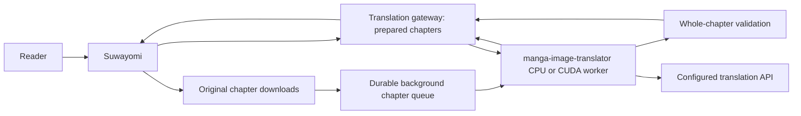

# Suwayomi Manga Translator

Prepare complete translated chapters ahead of reading, using Suwayomi's downloads and built-in HTTP image processor.
No Suwayomi fork, reader patch, or replacement source extension is required.

The service uses [manga-image-translator](https://github.com/zyddnys/manga-image-translator)
for detection, OCR, inpainting and typesetting, and a configurable LLM for
language decisions and translation into Simplified Chinese.

**Preview:** Linux ARM64 CPU and WSL2 NVIDIA GPU deployments. First-time translation takes time;
previously processed pages are served from disk. Chinese and uncertain regions
are excluded before erasing. OCR and language identification are imperfect.

## What you get

- Automatic preparation of new completed Suwayomi downloads.
- Durable chapter queue, per-page resume, whole-chapter validation and translated CBZ export.
- Instant reading of prepared chapters, including when the worker is offline.
- Optional automatic image processing while reading through Suwayomi.
- Region-level Chinese/uncertain-text skipping and original-image fallback.
- Content-addressed cache, duplicate-request coalescing, bounded queue and retries.
- Management page: select chapters by manga URL/ID, pause/resume, monitor progress, retry, export and compare test pages.
- Separate gateway and CPU/CUDA worker containers, with CPU and memory limits.
- Streaming PNG responses for slow pages, keeping Suwayomi's 30-second idle read timeout alive.



The chapter manager uses Suwayomi's chapter API and raw downloaded CBZ export.
The read hook matches original image bytes to the verified chapter manifest.
Existing browser/reader caches may need refreshing after preparation.

## Download ahead (default)

1. Download chapters normally in Suwayomi. The gateway checks completed downloads every 30 seconds.
2. Open the management page and wait for the chapter status to become **ready**.
3. Read the same manga/chapter in Suwayomi. Prepared pages come directly from gateway disk.
4. To save the translated edition on another device, use **Translated CBZ** in management.

You can also paste a Suwayomi manga URL or numeric ID into management, select up
to 100 chapters, and choose **Download & translate selected**. Native downloads
run first; translation starts after the chapter download completes. Chapters
already downloaded on the gateway's first successful scan are listed as
**available** for manual preparation, preventing an unexpected library-wide job.

**Original downloads remain in Suwayomi.** Its native downloaded badge and native
CBZ export describe originals, not translation readiness. The gateway keeps a
separate translated edition under `data/chapters/`. Do not configure
`downloadConversions` to point at the reader endpoint: upstream can mark a
download complete even after conversion errors, and reader fallbacks preserve
originals. This integration never overwrites or removes native chapter files.

A chapter becomes ready only after every page is translated or validly skipped,
checksummed, decoded, and included in a verified CBZ. Until then the default
`chapters` mode returns originals without starting online inference. Chinese,
uncertain and text-free pages retain their original bytes. Cancel drains the in-flight pages and stops further translation; it does not cancel Suwayomi downloads.
Pause also drains in-flight pages before stopping. Successful pages survive retries/restarts.
Worker/network outages wait and retry every 60 seconds; other processing errors
retry three times before requiring manual retry. The worker exits if a single
inference exceeds 300 seconds (`WORKER_PAGE_TIMEOUT`); Docker's restart policy
recycles it, and chapter processing resumes from its last verified page. Direct
non-Docker deployments must use a process supervisor for this recovery. A tunnel
can still time out earlier; these pages remain pending instead of being published. Native download waits time out
after 30 minutes, with a message to check Suwayomi's download queue.

Page processing uses a bounded pipeline: while one page waits for cloud translation,
the next can run detection and OCR. Up to two cloud requests may overlap. All local
model stages (including mask generation, inpainting and rendering) remain under
one exclusive lock, sharing upstream model weights. Each page owns a separate
translator context, language evidence and force flag. Chapters still queue one at
a time; completed pages can checkpoint out of order, but CBZ order stays unchanged.

`PAGE_CONCURRENCY=2` is the default on **both gateway and worker**. Set it to `1`
on both hosts and recreate the affected services to restore serial admission.
Only 1 and 2 are supported to bound RAM, VRAM and cloud API load. A saturated
worker returns 503, and chapter preparation retries instead of publishing originals
as translations. Already submitted pages can finish after pause, cancel or a
language-rule change; no new pages are submitted once the change is observed.
Confirmed Chinese books bypass this pipeline entirely. Model, prompt and cache
profile do not change with concurrency. This improves chapter throughput; it does
not promise to halve individual page latency.

Chapter storage is durable and separate from the disposable page cache: default
20 GiB total (`CHAPTER_MAX_BYTES`), without age eviction. Budget space for original
CBZ, prepared pages and translated CBZ. Remove a translated copy in management to
reclaim its managed files; native originals remain. Per-chapter limits: 1 GiB
archive/expanded image data, 1,000 pages, 25 MiB and 24 million pixels per page.
Back up the whole `data/chapters` directory, including its SQLite database.
Changing `CACHE_PROFILE` affects new work; an existing ready edition remains
readable until explicitly removed and prepared again.

Set `SUWAYOMI_URL` in Compose `.env` to the trusted internal Suwayomi API (default
`http://suwayomi:4567`). If needed, set `SUWAYOMI_AUTHORIZATION` in protected
`gateway.env`. Local-source chapters require a read-only mount and currently
support CBZ/ZIP only. For example, add to `compose.override.yaml`:

```yaml
services:
  gateway:
    volumes:
      - /your/suwayomi/local:/suwayomi-local:ro
```

**Upgrade from v0.2.0:** rebuild/recreate the gateway with its Suwayomi API URL;
the existing worker and model configuration remain compatible. Upgrade the worker
as well to enable automatic recovery from stuck GPU inference. Chapter mode is
the new default. The first successful scan only records existing downloads.
Use the online-fallback checkbox to opt back into on-demand page processing.

## Remember Chinese manga

The gateway remembers a language policy for each Suwayomi manga ID. Editions from
different sources are separate records, even when their titles match.

In **Auto**, a completely verified chapter establishes Chinese only when at least
three distinct pages contain confident Chinese dialogue, with at least six regions
and 80 Han characters in total, and no foreign or uncertain alphabetic text. Any
previously observed foreign-language page blocks automatic Chinese classification.
Blank chapters, Chinese covers/credits alone, incomplete jobs and historical
`skipped` cache entries without language evidence cannot establish the language.
Language evidence consists only of counts, not retained OCR dialogue.

After Chinese is established, later downloaded chapters skip detection, OCR,
translation, inpainting and typesetting. The gateway briefly reads the raw chapter
to validate and index original image hashes, then discards a newly acquired managed
archive; it generates no translated pages or CBZ. Their status is **original**.
The first checked chapter and any existing prepared copies are retained. Read and
export originals through Suwayomi. Changing to original-only also overrides prepared
images when those original bytes are encountered by the reader.

Management provides **Auto**, **Always process** (disable automatic book skipping),
and **Original only** (manual override), plus **Reset detection** for a learned
Chinese book. Reset retains past foreign-language observations; use Original only
for an explicit override. Changes take effect after in-flight pages finish. Resetting makes
previously bypassed chapters available for manual preparation; it does not trigger
an unexpected library-wide retranslation. Chinese regions remain preserved even
with Always process. A later chapter can change language, so override/reset the
policy if an edition switches translators or contains multilingual chapters.

Suwayomi's read hook still sends image bytes through the gateway; the original
response bypasses the models. In default chapter mode, even unindexed pages return
originals without inference. Optional online fallback cannot associate a previously
unseen, unindexed image with a manga ID, so book rules apply there only after its
downloaded chapter has been indexed. Page-test uploads remain explicit model tests.

Upgrade both gateway and worker for language evidence. Existing cache results and
prepared chapters remain usable, but missing historical language evidence is not
inferred from a skipped result. Back up the gateway's SQLite databases before this
schema upgrade; an older gateway requires restoring its corresponding databases
for rollback.

## Install on Linux ARM64

Requires Docker Compose, approximately 5 GB available RAM for the configured worker
limit, disk space for the build, models and cache, and a working translation API.
The worker image is built on your ARM machine; no emulation is needed.
For a remote NVIDIA worker, see the GPU instructions below.

```sh
git clone https://github.com/meurz/suwayomi-manga-translator.git
cd suwayomi-manga-translator
python3 scripts/init_config.py
# Edit worker.env: LLM_BASE_URL, LLM_API_KEY, LLM_MODEL, LLM_API.
# Use an OpenAI-compatible Responses API (responses) or Chat Completions API (chat).

# Set this to a Docker network your existing Suwayomi container is connected to.
export SUWAYOMI_NETWORK=your-suwayomi-network

docker compose build
docker compose run --rm worker python /app/scripts/warm_models.py
docker compose up -d
```

The upstream engine is pinned to commit `95227a2bb0fd306cd4f0c104d57284026f991b3a`.
The ARM worker dependency installation is pinned in `deploy/requirements-worker.lock`.
The optional Rust Paddle detector registration is disabled for this CPU build;
the upstream PyTorch detector, 48px OCR and LaMa MPE inpainter are used.

No API credentials belong in the repository or image. `worker.env` and
`gateway.env` are ignored by Git and Docker build contexts. Model changes also
require a new `CACHE_PROFILE` in `gateway.env`, preventing stale translations.

## Remote NVIDIA GPU worker (including WSL2)

Keep the gateway next to Suwayomi and run only the image worker on the GPU host.
Requires Docker Compose with GPU support, NVIDIA Container Toolkit and a working
`nvidia-smi`. The x86_64 worker installs CUDA-enabled PyTorch from the dependency
lock; ARM64 remains the CPU deployment described above.

On the GPU host:

```sh
python3 scripts/init_config.py
# Configure the translation API in worker.env.
docker compose -f compose.gpu.yaml build
docker compose -f compose.gpu.yaml run --rm worker python /app/scripts/warm_models.py
docker compose -f compose.gpu.yaml up -d
curl http://127.0.0.1:18442/health
# Must report device=cuda and ok=true; unavailable CUDA does not silently fall back.

# On WSL2, explicitly allow its DirectX GPU device:
docker compose -f compose.gpu.yaml -f compose.wsl.yaml up -d

# Temporary connectivity test, with cloudflared installed:
cloudflared tunnel --url http://127.0.0.1:18442 --protocol quic
```

The worker admits up to two pages and binds only to loopback. All routes
except health require `X-Worker-Token`; do not remove this authentication when
publishing a tunnel. Copy only the matching `WORKER_TOKEN` into the ARM gateway's
`gateway.env`, using a protected channel. Keep both env files mode 0600.

On the gateway host, set `WORKER_URL=https://YOUR-WORKER-HOSTNAME` in the Compose
`.env` file (the URL is not a secret), then recreate only the gateway:

```sh
docker compose up -d --no-deps gateway
```

Use a new `CACHE_PROFILE` when benchmarking an uncached GPU result. Existing
cache entries otherwise bypass inference and cannot measure GPU performance.
Quick Tunnel addresses are temporary; after verifying connectivity, configure a
named Cloudflare Tunnel with a stable hostname targeting `http://127.0.0.1:18442`.
The gateway sends the worker token over HTTPS. A remote worker receives page images;
the translation API still receives only OCR text.

The GPU host, Docker and tunnel must remain running. WSL/Windows sleep or tunnel
failure pauses chapter preparation until connectivity recovers; prepared chapters
remain readable and exportable. Optional online mode falls back to originals. To return to the local CPU worker, remove the `WORKER_URL` override and
recreate the gateway. Ensure its worker token matches the CPU worker too.

**Upgrade from v0.1.0:** worker authentication is now required. Run
`scripts/init_config.py` to add a shared token to existing local env files, then
recreate both services. For hosts with separate env files, distribute the same
token explicitly before switching the gateway.

## Connect Suwayomi

Verified against Suwayomi Server **v2.3.2243**. The helper uses GraphQL settings;
Suwayomi applies the change at runtime without a source edit or restart.
Run it where the Suwayomi API is reachable. It currently expects a trusted local
API; if your API requires authentication, use its settings UI or adapt the
request headers to your authentication setup.

```sh
set -a
. ./gateway.env
set +a
python3 scripts/connect_suwayomi.py --server http://YOUR_SUWAYOMI_ADDRESS:4567
```

The helper backs up the previous `serveConversions`, then configures the
`default` image processor as `http://suwayomi-translator:8000/convert`, with the
processor token in a request header. It leaves `downloadConversions` untouched
so original server downloads remain available.

You can also set the equivalent `server.serveConversions` in `server.conf`:

```hocon
server.serveConversions = {
  default = {
    target = "http://suwayomi-translator:8000/convert"
    callTimeout = "120s"
    connectTimeout = "10s"
    headers = { "X-Processor-Token" = "YOUR_PROCESSOR_TOKEN" }
  }
}
```

Avoid replacing other conversion rules without reviewing them. The helper's
backup can restore them:

```sh
python3 scripts/connect_suwayomi.py --server http://YOUR_SUWAYOMI_ADDRESS:4567 --restore
```

## Management page

The gateway is bound to `127.0.0.1:18440` on the host. `/admin/` and all its API
routes require `X-Admin-Token`. Place the page behind your existing authenticated
reverse proxy and inject that header **after** authentication. Never expose a
proxy that injects the token without authenticating the browser first.

For local use, the supplied proxy serves the UI only on loopback and reads the
admin token from your local `gateway.env`:

```sh
python3 scripts/local_ui.py
# Open http://127.0.0.1:18441/
```

The UI shows the latest 200 chapter jobs and 100 test-page jobs, with chapter
selection, pause, automatic-download monitoring, retries and translated CBZ export.
Page testing and optional online controls are under a collapsible section. API model/key configuration
is currently through `worker.env`, followed by `docker compose up -d`.

## Optional online reading behavior and limits

| Situation | Behavior |
| --- | --- |
| Cached image | Return the cached result immediately |
| Chinese or uncertain text | Preserve those regions; if all regions are skipped, cache the original bytes |
| Mixed-language page | Erase and typeset only confidently translated regions |
| No text | Return the original |
| Slow page | Start a valid PNG stream after 10 seconds; ancillary chunks keep idle timers alive while processing |
| Failure, full queue or wait budget exceeded | Show the original; background work may finish later |
| Animated / oversized / unsupported image | Reject processing; Suwayomi's read-path fallback can serve the original |

A streamed fallback is losslessly re-encoded as RGBA PNG: pixels are retained,
but file bytes, EXIF metadata and encoding are not. Fast/cached skipped responses
return the original file bytes. A slow stream is not a progressive preview of the
translation: the reader waits for the completed pixels.

The stream waits up to 80 additional seconds after its initial 10-second wait.
Longer jobs continue in the background. Refresh the reader's image cache after
a fallback completes. Suwayomi itself may emit a one-day cache header, overriding
the gateway's `no-store`; the service cannot invalidate existing client caches.

The queue defaults to 8 jobs and 1 inference worker. The cache is capped at 2 GiB
and expires old completed entries after 30 days (pruned when jobs finish).
Changing the API model, prompt, target language or rendering behavior requires
changing `CACHE_PROFILE`. Per-page retries retain the selected force mode.

This is automatic machine translation, not verified human translation. Names,
short Han-only Japanese text, stylized sound effects, complex art backgrounds,
page-edge text and small bubbles remain difficult. The edge-render guard only
repairs regions where upstream rendering added no pixels at all.

## Privacy and operation

OCR and image repair run in the worker. Only recognized text is sent to the
configured LLM. Originals and results are stored in the gateway's `data/` volume;
protect it like your manga library. The API does not accept arbitrary remote
image URLs. Both processor and management routes require separate credentials.

```sh
docker compose logs --tail 100 gateway worker
docker compose ps
curl http://127.0.0.1:18440/health
```

Use chapter pause to stop background work after in-flight pages finish. Prepared
chapters remain served. Restore Suwayomi's old configuration to bypass all
translation before shutting down the service. Do not remove `data/` or the
Suwayomi library to uninstall this integration.

## Development

```sh
uv sync --locked
uv run ruff check src tests scripts
uv run ruff format --check src tests scripts
uv run pytest -q
```

Tests cover deduplication, exact skipped-image preservation, language filtering,
malformed provider output, authentication, fallback, streaming PNG integrity,
restart recovery, cache eviction and edge typesetting. Live inference evidence
and its limitations are recorded in [docs/verification.md](docs/verification.md).

## License

GPL-3.0-or-later. The deployment uses the GPL-3.0 upstream engine, with a small
CPU compatibility adjustment and an application subclass. Upstream model and
font assets retain their own terms. Test manga and API credentials are not
included in this repository.
